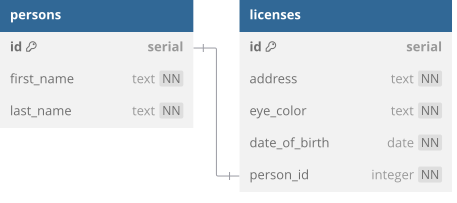

# DMV

You've been hired by the local department of motor vehicles to handle their database of driver's licenses!

## Create related tables



<details>
<summary>See DBML</summary>

```dbml
table persons {
  id serial [pk]
  first_name text [not null]
  last_name text [not null]
}

table licenses {
  id serial [pk]
  address text [not null]
  eye_color text [not null]
  date_of_birth date [not null]
  person_id integer [unique, not null]
}

Ref: persons.id - licenses.person_id
```

</details>

1. Create a database named `dmv` and a corresponding `.env` file.
2. Create the `persons` table in `schema.sql` according to the schema above.
3. Create the `licenses` table in `schema.sql` according to the schema above.
   1. Place a unique constraint on the `person_id` field.
   2. Place a [**foreign key constraint**](https://www.postgresql.org/docs/17/ddl-constraints.html#DDL-CONSTRAINTS-FK)
      on the `person_id` column so that it references the `id` column of the `persons` table.
   3. If a person is deleted, that deletion should **cascade** to the related license.
4. Sync the database with the schema and check that you are passing all test cases.\
   `npm run db:schema`\
   `npm run test schema`
5. Once you are passing all test cases, seed the database with the provided
   script. Check the output for any error messages. If you don't see any, then
   you're good to continue to the next section!\
   `npm run db:seed`

## Query related records

Now that the tables are seeded with data, let's write the corresponding queries! Start in
`db/queries/persons.js`. Most of the functions are already completed for you to use as
reference.

6. Complete `getPersonsWithoutLicense`. Not every person has a license, so you will
   need to use an **outer join** and check if something `IS NULL`.
7. `getPersonsIncludingLicense` uses a **subquery**, which is a query nested within
   another query, to grab license information while querying persons. What is the
   **alias** defined for this subquery, as indicated by the `AS` keyword?
8. What is the purpose of the `to_json` function used in the subquery?
9. Complete `getPersonByIdIncludingLicense`.

Once your code passes all test cases when you run `npm run test persons`, move on
to completing the queries in `db/queries/licenses.js`.

10. Complete `getLicensesIncludingPerson`. Each license in the returned array of
    licenses should have a `person` key, the value of which is an object containing all of
    the information about the associated person.
11. Complete `getLicenseByIdIncludingPerson`, which returns just one license with the
    associated person attached under the `person` key.
12. Complete `getLicenseByPersonId`, which finds and returns the license by the person's
    id, rather than the license id. The related person does not need to be attached.
